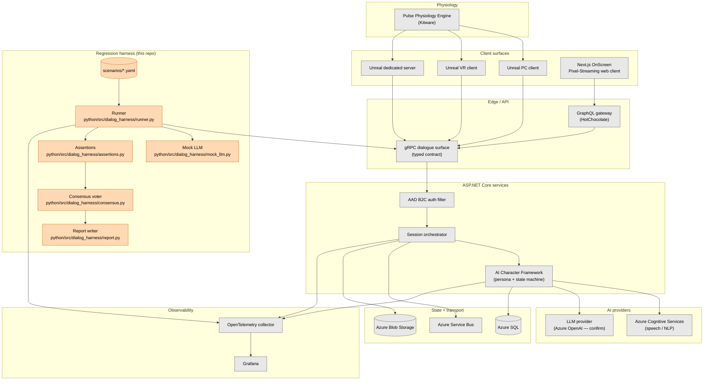

# Architecture

Last updated: 2026-04-30

**TL;DR:** The harness is a black-box client that drives the same gRPC dialogue surface a learner's Unreal client would hit, then evaluates the transcript with deterministic assertions and N-of-M consensus voting. It sits one layer above the gRPC contract so it's resilient to internal refactors of the AI Character Framework, and it integrates into Azure DevOps Pipelines without requiring code changes inside the InvolveXR backend.

## 1. Overview

InvolveXR is a multi-surface clinical simulation platform: learners interact with patient agents through Unreal (PC, VR, dedicated server) and through a Pixel-Streaming web client. Behind the scenes, ASP.NET Core services orchestrate patient personas, route to a speech/NLP layer (Azure Cognitive Services for transcription and synthesis, an LLM provider for dialogue generation), and persist session state to Azure SQL. A SpecFlow + xUnit test suite covers the existing service contracts.

The gap this harness fills is the **dialogue layer itself**. Today, regression on patient-agent behavior depends on either (a) human SMEs running scenarios manually, or (b) live-LLM tests that flake and burn budget. Neither catches persona drift, hallucinated drug names, or P95 latency creep before they reach faculty.

The harness sits as a synthetic learner on the gRPC dialogue surface and runs scenarios from YAML. Each scenario lists probes (learner utterances) plus the things the patient response must and must not contain. The harness drives the surface, captures the response, runs a battery of assertions, and emits a markdown + JSON report.

It does **not** replace SpecFlow integration tests. It complements them — SpecFlow covers the deterministic service contract, the harness covers the non-deterministic dialogue layer.

## 2. System diagram

The gray nodes are the existing Lumeto stack as publicly described. The orange nodes are what this harness adds. The harness pulls scenarios from YAML, drives the gRPC surface as a synthetic learner, and writes traces back into the same OpenTelemetry collector that the production services use — so a regression run shows up in Grafana with the same trace IDs the engineers already know.

## 3. Integration points

|Boundary|Lumeto side|Harness side|Notes|
|-|-|-|-|
|Auth|AAD B2C bearer token|Service-principal token cached per run|See [integration_with_lumeto_stack.md](./integration_with_lumeto_stack.md) for the token-vending flow|
|Dialogue|gRPC `DialogueService.SendUtterance`|`runner.py` `send_utterance()`|Harness uses generated client stubs; treats the contract as opaque past the response field|
|LLM|Live Azure OpenAI / Anthropic|`mock_llm.py` deterministic stub or `real_llm.py` provider|Mock is default; real provider gated behind env flag — see [ADR-003](./adr/ADR-003-mock-by-default-llm-client.md)|
|Telemetry|OTel collector → Grafana|`runner.py` emits spans tagged `harness.run_id`|Same collector endpoint as prod; tags isolate harness traffic|
|Storage|Azure Blob for transcripts|Local `python/reports/` or Azure Blob in CI|Configurable via env|

The harness never reaches into the ACF state machine directly. Everything goes through the gRPC contract. This is deliberate — see [ADR-005](./adr/ADR-005-python-prototype-vs-csharp-production.md) for the discussion of why a black-box client is the right choice for this layer specifically.

## 4. CI integration

In a Lumeto Azure DevOps pipeline, the harness slots in as a separate stage that runs after the existing xUnit suite has gone green. A typical pipeline:

1. Build and unit-test ASP.NET Core services (existing xUnit + Moq + WebApplicationFactory).
2. Deploy to a per-PR ephemeral environment via Terraform.
3. Run SpecFlow integration tests against the ephemeral env.
4. **Run the harness in mock-LLM mode** against the ephemeral env's gRPC surface.
5. Optionally, run the harness in live-LLM mode on `main` only, on a nightly schedule.
6. Publish the harness markdown + JSON report as a build artifact and post a summary to the PR.

The harness exit code maps to the pipeline result: 0 if all consensus assertions pass, non-zero otherwise. The JSON output is the source of truth; the markdown is for humans.

A pipeline snippet is in [integration_with_lumeto_stack.md](./integration_with_lumeto_stack.md).

## 5. Observability

Every harness run gets a `harness.run_id` (UUIDv7 — sortable, useful for log queries). Every probe gets a child span with attributes for scenario id, probe index, language, latency, and pass/fail. The collector is the same OTel endpoint the InvolveXR services already point at, so traces from a regression run appear next to the trace from the synthetic learner's gRPC call in Grafana.

This matters because flakes are usually not random. They're correlated with downstream conditions — slow Azure OpenAI region, cold Azure SQL pool, queue depth on Service Bus. Putting harness spans in the same collector means an engineer investigating a CI red can pivot from "the harness flagged a P95 regression on probe 3" to "Azure OpenAI eastus2 had 8s P99 latency that hour" without leaving Grafana.

The OTel emitter is intentionally simple — it's a 30-line span wrapper, not the full OTel SDK, so the Python harness doesn't have to ship the entire OTel pip dependency tree. A C# port would use the official `OpenTelemetry.Api` package.

## 6. Multi-tenant considerations

InvolveXR appears to run per-customer Azure AD B2C tenants. A regression run targeting a customer-specific test tenant has to:

- Use a service principal scoped to that tenant only (no cross-tenant token).
- Tag every span with `tenant.id` and never write transcripts to a shared storage path.
- Use scenarios curated for the tenant's clinical content if their patient personas diverge from the shared base set.

The current harness reads a `LUMETO_TENANT_ID` env var. The runner injects it into both the gRPC metadata and the OTel span attributes. There is no cross-tenant fan-out — a single harness run is single-tenant by construction. Multi-tenant runs are handled at the pipeline level: parallel jobs, one per tenant, each with its own scoped credentials.

This design choice is conservative on purpose. The cost of a tenant-bleed bug (one customer's transcript leaking into another's report) is far higher than the cost of an extra pipeline job.

## 7. What's intentionally NOT shown

|Omitted|Why|
|-|-|
|Real LLM provider routing|Lumeto has not publicly confirmed which LLM vendor sits behind ACF. The diagram shows a generic "LLM provider" node and the harness assumes nothing about routing logic. See [v0_5_roadmap.md](./v0_5_roadmap.md) for what a multi-vendor abstraction would look like|
|ACF internal state machine|The harness is a black-box client by design. The state machine boundaries — turn-taking, persona swap, escalation — are inferred from external behavior, not modeled directly. Internal refactors are invisible to the harness so long as the gRPC contract holds|
|Pulse → Unreal IPC|The physiology pipe is out of scope. The harness verifies dialogue, not vitals. A separate physiology-regression harness would test that pipe — different test pyramid, different flake profile|
|Pixel Streaming session bring-up|The OnScreen web client adds WebRTC negotiation, signaling server, GPU pool selection. None of that affects dialogue correctness. A multi-surface coverage layer (Playwright probes against the web client) is on the roadmap, not in v0.4|
|GraphQL schema specifics|HotChocolate is mentioned for context. The harness drives gRPC directly because that's where the dialogue contract lives. GraphQL is the read API, not the dialogue API|

## 8. Why this layer

A natural question: why test at the gRPC dialogue surface and not at the LLM provider boundary directly? Two reasons.

First, persona logic lives in ACF, not in the LLM. A test that hits Azure OpenAI directly would re-test the model — not the InvolveXR system prompt, not the conversation history compaction, not the tool-call routing for vitals lookups. Persona drift bugs are almost always in the orchestration layer, not the model.

Second, the gRPC contract is the most stable boundary that still lets us see persona behavior. Anything below it (the ACF state machine, the prompt templates, the tool-call protocol) changes faster than a test suite can keep up with. Anything above it (the Unreal client, the Pixel Streaming pipe) introduces transport flake that is unrelated to dialogue correctness.

The gRPC surface is the right altitude. It's where the contract is written down, it's where the team's typed clients get generated, and it's where a synthetic learner can talk to the system in the same shape a real learner does — without paying the cost of a full Unreal session bring-up per test.

For the deeper rationale on assertion design, see [testing_philosophy.md](./testing_philosophy.md) and [ADR-001](./adr/ADR-001-semantic-vs-string-assertions.md).
