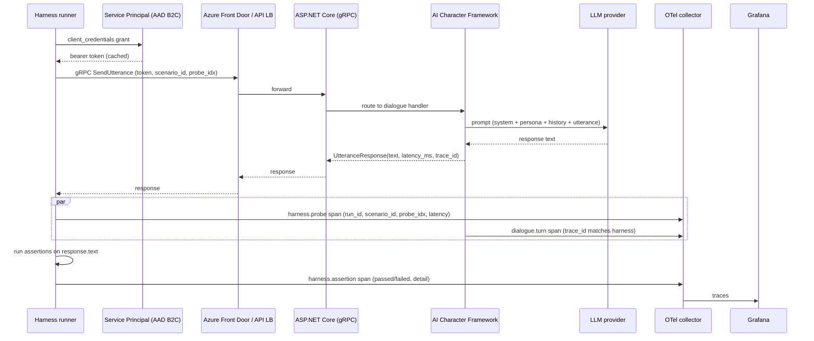

# Integration with the Lumeto Stack

Last updated: 2026-04-30

**TL;DR:** The harness can drop into a Lumeto deployment two ways — as a sibling test project that boots ASP.NET Core in-process via `WebApplicationFactory`, or as a standalone black-box client that hits the deployed gRPC surface. Both have a place. This doc shows the wiring for each, the Azure DevOps Pipelines yaml, the gRPC contract-test pattern, the reporting hookup back to the team, and the versioning rules for keeping the harness compatible as the dialogue contract evolves.

## 1. Where it lives — two approaches

### Approach A: in-process, sibling to existing xUnit suite

```
src/
  InvolveXR.Api/                # existing ASP.NET Core
  InvolveXR.Acf/                # existing AI Character Framework
tests/
  InvolveXR.Api.Tests/          # existing xUnit + Moq + WebApplicationFactory
  InvolveXR.Acf.Tests/          # existing
  InvolveXR.Dialog.Regression/  # new — the harness
```

Pros:

- Reuses the existing `WebApplicationFactory<Program>` fixture.
- Sees and overrides DI registrations — swap the live LLM client for a mock with one line in `ConfigureTestServices`.
- Runs in CI in milliseconds per scenario, against an in-process gRPC server.
- Shares `appsettings.Test.json`, secret scopes, and helper extensions.

Cons:

- Doesn't exercise the real wire path: AAD B2C auth, network failure modes, OTel collector, Service Bus throttling.
- Single-process means single-language (C#).
- Can mask bugs that only appear in a real deployment (e.g., header-too-large, gRPC retry policy, TLS).

### Approach B: out-of-process, standalone black-box client

```
involvexr-dialog-regression-harness/   # this repo
  python/                              # current implementation
  scenarios/
  reports/
```

Pros:

- Tests the real wire path including auth and transport.
- Language-agnostic — backend can refactor to a different ASP.NET Core version, swap dependency injection containers, add gRPC interceptors, and the harness doesn't notice.
- Runs against any environment: PR ephemeral, staging, prod-shadow, customer-specific test tenant.
- Catches the auth + telemetry + transport bugs the in-process version is structurally blind to.

Cons:

- Slower — each scenario pays network latency and auth round-trip.
- Doesn't see internal state, only the gRPC contract.
- Needs separate auth provisioning per environment.

### Recommendation

Run both, at different points in the test pyramid.

- Approach A on every PR, for fast feedback.
- Approach B on the post-deploy smoke stage, against the ephemeral environment that just got provisioned by Terraform.

The same scenario YAML files feed both. The assertion library is shared.

## 2. Sharing fixtures with `WebApplicationFactory`

Approach A in concrete C#:

```csharp
public sealed class HarnessFixture : WebApplicationFactory<Program>
{
    protected override void ConfigureWebHost(IWebHostBuilder builder)
    {
        builder.ConfigureTestServices(services =>
        {
            // Swap the live LLM client for a deterministic mock.
            services.RemoveAll<ILlmClient>();
            services.AddSingleton<ILlmClient, DeterministicMockLlm>();

            // Swap real Azure SQL for in-memory; harness doesn't depend on persistence.
            services.RemoveAll<DbContextOptions<AcfDbContext>>();
            services.AddDbContext<AcfDbContext>(o =>
                o.UseInMemoryDatabase($"harness-{Guid.NewGuid()}"));

            // Pin OTel to a recording exporter so we can assert on spans in tests.
            services.AddOpenTelemetry().WithTracing(t =>
                t.AddInMemoryExporter(InMemorySpanRecorder.Spans));
        });
    }

    public DialogueService.DialogueServiceClient CreateGrpcClient()
    {
        var handler = Server.CreateHandler();
        var channel = GrpcChannel.ForAddress(Server.BaseAddress, new GrpcChannelOptions
        {
            HttpHandler = handler
        });
        return new DialogueService.DialogueServiceClient(channel);
    }
}

public sealed class HarnessRunner : IClassFixture<HarnessFixture>
{
    private readonly HarnessFixture _fx;
    public HarnessRunner(HarnessFixture fx) => _fx = fx;

    [Theory]
    [MemberData(nameof(ScenarioFiles))]
    public async Task Scenario_PassesAllProbes(string scenarioPath)
    {
        var scenario = ScenarioLoader.Load(scenarioPath);
        var client = _fx.CreateGrpcClient();
        var report = await new DialogHarness(client).RunAsync(scenario);
        report.AllPassed.Should().BeTrue(report.FailureSummary());
    }

    public static IEnumerable<object[]> ScenarioFiles() =>
        Directory.GetFiles("../../../../scenarios", "*.yaml")
            .Select(p => new object[] { p });
}
```

This is the in-process bridge from Lumeto's existing test infrastructure to the harness's scenario format. **The same YAML files in `scenarios/` feed both the Python out-of-process runner and the C# in-process runner.** That's the key reuse.

## 3. gRPC contract testing

The dialogue surface has a typed gRPC contract. The harness as a black-box client should treat that contract as the boundary — not the ACF state machine, not the prompt templates, not the LLM provider.

```csharp
// generated from acf.proto
service DialogueService {
    rpc SendUtterance (UtteranceRequest) returns (UtteranceResponse);
    rpc StartSession (StartSessionRequest) returns (StartSessionResponse);
    rpc EndSession   (EndSessionRequest)   returns (EndSessionResponse);
}

message UtteranceRequest {
    string session_id    = 1;
    string utterance     = 2;
    string language_code = 3;
    int64  client_ts_ms  = 4;
}

message UtteranceResponse {
    string text         = 1;
    int32  latency_ms   = 2;
    string trace_id     = 3;
    repeated string telemetry_tags = 4;
}
```

Contract-level assertions the harness should run:

|Contract assertion|Why it matters|
|-|-|
|Field IDs are stable across versions|Adding a field is fine; renumbering breaks all clients|
|Response always has `trace_id` populated|Lets the harness pivot from a flake to the OTel trace|
|`latency_ms` matches the harness-measured wall clock within tolerance|Drift signals server-clock or measurement bugs|
|Required fields rejected when missing|Server-side validation actually runs|
|Backwards compat: old client → new server still works|Catches accidental breaking changes|

In CI, run a separate "contract" suite that exercises only the contract, with no LLM involved at all. Every gRPC field gets a positive and a negative test. This is fast (no LLM, no DB) and catches refactor regressions before any scenario runs.

## 4. Running in CI on Azure DevOps Pipelines

A representative `azure-pipelines.yml` snippet for the harness stage:

```yaml
stages:
- stage: BuildAndUnitTest
  jobs:
  - job: Build
    steps:
    - task: DotNetCoreCLI@2
      displayName: Build
      inputs: { command: build, projects: 'src/**/*.csproj', arguments: '-c Release' }
    - task: DotNetCoreCLI@2
      displayName: xUnit + SpecFlow
      inputs: { command: test, projects: 'tests/**/*.csproj', arguments: '-c Release --collect "XPlat Code Coverage"' }

- stage: DeployEphemeral
  dependsOn: BuildAndUnitTest
  jobs:
  - deployment: Ephemeral
    environment: 'pr-ephemeral'
    strategy:
      runOnce:
        deploy:
          steps:
          - script: terraform apply -auto-approve -var "pr_id=$(System.PullRequest.PullRequestId)"
            displayName: Provision ephemeral env
          - script: echo "##vso[task.setvariable variable=GRPC_ENDPOINT;isOutput=true]$(terraform output -raw grpc_endpoint)"
            name: setEndpoint
            displayName: Capture gRPC endpoint

- stage: DialogRegression
  dependsOn: DeployEphemeral
  variables:
    grpcEndpoint: $[ stageDependencies.DeployEphemeral.Ephemeral.outputs['Ephemeral.setEndpoint.GRPC_ENDPOINT'] ]
  jobs:
  - job: HarnessMockLlm
    displayName: Dialog harness — mock LLM
    steps:
    - task: UsePythonVersion@0
      inputs: { versionSpec: '3.12' }
    - script: |
        cd python
        pip install -e .
        python -m dialog_harness.runner \
          --scenarios ../scenarios \
          --grpc-endpoint $(grpcEndpoint) \
          --tenant $(LUMETO_TEST_TENANT_ID) \
          --provider mock \
          --report-out reports/$(Build.BuildId).md \
          --json-out reports/$(Build.BuildId).json
      displayName: Run harness (mock LLM)
      env:
        LUMETO_SP_CLIENT_ID: $(LumetoServicePrincipalClientId)
        LUMETO_SP_CLIENT_SECRET: $(LumetoServicePrincipalSecret)
    - task: PublishBuildArtifacts@1
      inputs:
        pathToPublish: python/reports
        artifactName: dialog-regression-report
    - script: |
        if [ -f python/reports/$(Build.BuildId).failed ]; then
          echo "##vso[task.complete result=Failed;]Dialog regression flagged failures"
        fi
      displayName: Fail build on regression

- stage: DialogRegressionLive
  condition: and(succeeded(), eq(variables['Build.SourceBranch'], 'refs/heads/main'))
  dependsOn: DialogRegression
  jobs:
  - job: HarnessLiveLlm
    displayName: Dialog harness — live LLM (main only)
    timeoutInMinutes: 30
    steps:
    - script: |
        cd python
        python -m dialog_harness.runner \
          --scenarios ../scenarios \
          --grpc-endpoint $(grpcEndpoint) \
          --provider azure_openai \
          --consensus-runs 5 \
          --consensus-threshold 4
      env:
        AZURE_OPENAI_KEY: $(AzureOpenAiKey)
```

Key points:

- The mock-LLM stage runs on every PR, gates merge, takes <2 minutes.
- The live-LLM stage runs only on `main`, with a budget cap and a higher consensus threshold (because real LLMs are noisier than the mock).
- Reports go up as build artifacts; the JSON is the source of truth, the markdown is for humans.

## 5. Reporting back to the team

Three reasonable destinations, each catching a different audience:

|Destination|Audience|Trigger|
|-|-|-|
|Azure DevOps test results UI|Engineers debugging a red build|Every harness run|
|GitHub Actions PR comment (or AzDO equivalent)|PR author and reviewer|On harness failure|
|Slack #infra-alerts|On-call engineer|Live-LLM run on `main` failed|

The current Python `report.py` writes both markdown (for the PR comment) and JSON (for the test results UI). For the Slack hook, the runner should support a `--slack-webhook` flag that posts a one-line summary on failure with a link to the build artifact. That's a v0.5 feature.

The PR-comment shape that has worked well in similar harnesses:

```
Dialog regression: 2 of 3 scenarios passed.

  difficult_airway_v1     PASS  (15/15 probes, p95 1840ms)
  code_blue_pediatric_v1  FAIL  (13/15 probes, p95 2620ms exceeds budget 2500ms)
                          - probe[2] mentions: missing "epinephrine"
                          - probe[7] latency_p95: 2620ms > 2500ms
  breaking_bad_news_v1    PASS  (12/12 probes, p95 1150ms)

Full report: https://dev.azure.com/.../artifacts/dialog-regression-report
Trace: open in Grafana
```

Three things make this useful in practice:

1. The pass/fail summary is the first line, so the GitHub PR collapsed view shows it.
2. Each failure includes the assertion name and the offending detail — enough to know whether it's a content regression or a latency regression without opening the artifact.
3. Trace links go directly to Grafana with the scenario filter pre-applied. **The harness having the same OTel collector as production is what makes this work.**

## 6. Versioning the harness alongside the API

The dialogue gRPC contract is the boundary, and proto contracts evolve. Rules for keeping the harness compatible:

|Change|Compat impact|Harness response|
|-|-|-|
|Add an optional field|None|Rebuild generated stubs, no test changes|
|Add a new RPC|None|Optionally add scenarios that use it|
|Rename a field|Breaking|Pin harness to old proto until callers migrate; use proto field tag, not name|
|Change a field type|Breaking|Same as rename|
|Remove an RPC|Breaking|Hard break — coordinate harness release with backend release|
|Change response semantics (same shape, different content)|Silent regression|This is exactly what the harness is for — assertions catch it|

Practical rules:

- **The harness pins to a specific proto SHA**, not "latest". When the backend releases a new proto, the harness's PR rolls forward to that SHA and re-runs against staging.
- **Scenarios are versioned with the harness**, not with the backend. A scenario file lives at one version; behavior changes get a new scenario, not an in-place edit, so the regression history is preserved.
- **The harness has its own SemVer line.** A breaking proto change bumps the major version. A new scenario or a new assertion bumps the minor. A bug fix bumps the patch.
- **The CI matrix runs the last two harness majors** against `main` for one release window after a major bump, so a backend rollback doesn't strand the test suite.

## 7. Data flow at runtime

Here's the request flow when the harness runs against a deployed environment:



The trace IDs line up because the harness propagates the `traceparent` header through gRPC metadata. An engineer triaging a red build clicks the trace link in the PR comment and lands in Grafana with both the harness probe span and the dialogue turn span side by side. **That's the integration that makes red builds actionable instead of frustrating.**
